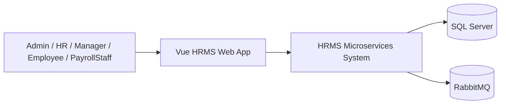
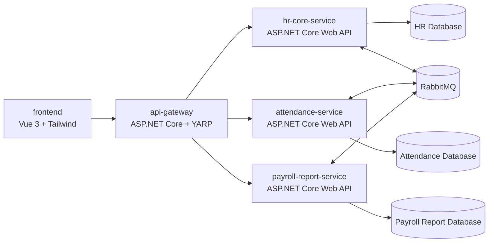
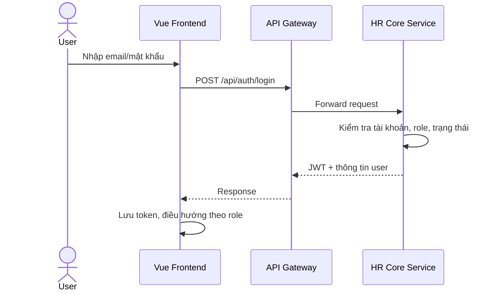
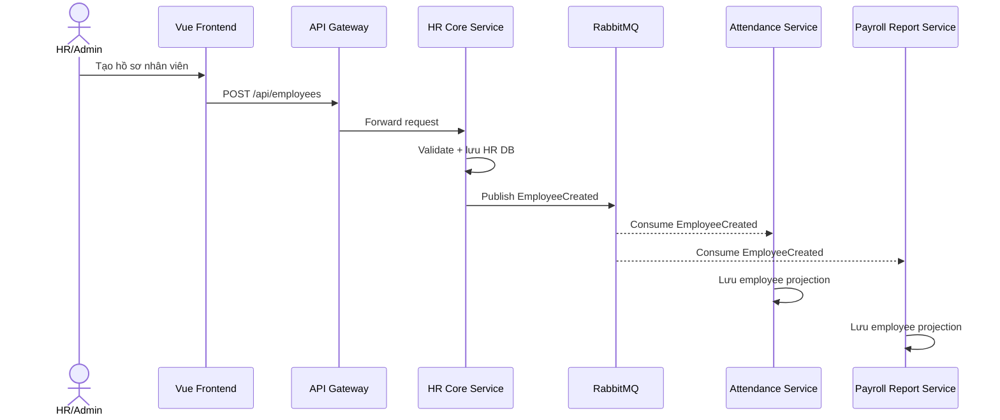
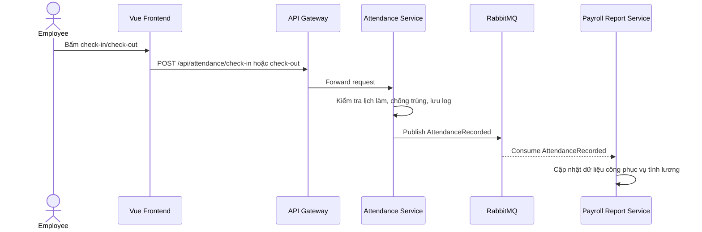
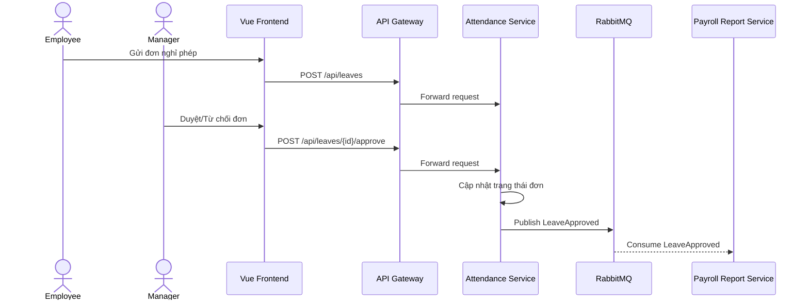
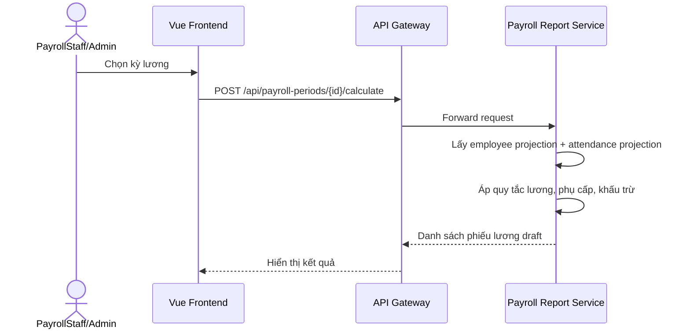
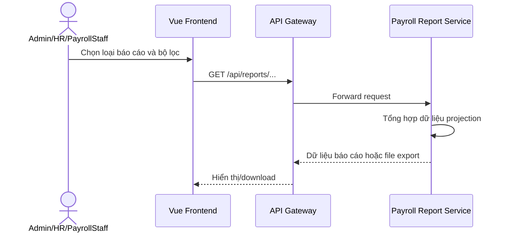

# Phân tích tổng thể đề tài số 3 - Quản lý nhân sự và chấm công

## 1. Thông tin chung

### 1.1. Tên đề tài

Đề tài số 3: **Quản lý nhân sự và chấm công**.

Hệ thống được xây dựng theo hướng full stack và kiến trúc microservices. Ba nhóm cùng phát triển trong một dự án lớn, mỗi nhóm phụ trách một service độc lập nhưng phải tuân thủ cùng một khung kiến trúc, chuẩn API, chuẩn event, chuẩn bảo mật, chuẩn UI và quy trình GitHub.

### 1.2. Công nghệ sử dụng

- Frontend: Vue 3, Vite, TypeScript nếu nhóm đủ năng lực, Tailwind CSS.
- Backend: ASP.NET Core Web API, C#.
- Database: SQL Server, mỗi service sở hữu database/schema riêng.
- Event bus: RabbitMQ.
- API Gateway: YARP hoặc một ASP.NET Core gateway riêng.
- Auth: JWT Bearer token do HR Core Service phát hành.
- Dev environment: Docker Compose.
- Source control: GitHub, Pull Request, branch protection.

### 1.3. Mục tiêu hệ thống

- Quản lý hồ sơ nhân sự, phòng ban, chức vụ, hợp đồng và trạng thái nhân viên.
- Quản lý ca làm, lịch làm, check-in/check-out, đơn nghỉ phép và bảng công.
- Tính lương từ dữ liệu nhân sự và dữ liệu công, xuất phiếu lương và báo cáo.
- Cho phép các nhóm phát triển độc lập nhưng tích hợp được thành một hệ thống chạy chung.
- Có tài liệu checklist để người hoặc agent tiếp theo biết đã làm đến đâu và tiếp tục đúng kiến trúc.

### 1.4. Phạm vi theo nhóm

| Nhóm | Service | Vai trò chính |
| --- | --- | --- |
| Nhóm 7 | HR Core Service + kiến trúc khung | Quản lý nhân sự, auth, role, dựng skeleton, chuẩn tích hợp, merge code |
| Nhóm 8 | Attendance Service | Quản lý chấm công, ca làm, lịch làm, nghỉ phép, bảng công |
| Nhóm 9 | Payroll & Report Service | Quản lý lương, phiếu lương, báo cáo nhân sự/công/lương |

## 2. Kiến trúc tổng thể

### 2.1. C4 - Context



Người dùng thao tác trên Vue web app. Frontend chỉ gọi API Gateway. API Gateway chuyển request đến các service phù hợp. Các service lưu dữ liệu riêng và phát event qua RabbitMQ khi có thay đổi nghiệp vụ quan trọng.

### 2.2. C4 - Container



### 2.3. Component chính

HR Core Service:

- Auth module: login, JWT, refresh token nếu kịp, role/claim.
- User/Role module: tài khoản, vai trò, phân quyền.
- Employee module: hồ sơ nhân sự.
- Department module: phòng ban.
- Position module: chức vụ.
- Contract module: hợp đồng.
- Event publisher: phát event nhân sự.

Attendance Service:

- Shift module: ca làm.
- WorkSchedule module: lịch làm.
- CheckInOut module: ghi nhận check-in/check-out.
- Timesheet module: bảng công.
- LeaveRequest module: đơn nghỉ phép và duyệt nghỉ.
- Employee projection: bản sao tối thiểu dữ liệu nhân viên từ HR Core.
- Event publisher/consumer: nhận event nhân sự, phát event chấm công/nghỉ phép.

Payroll & Report Service:

- PayrollPeriod module: kỳ lương.
- PayrollRule module: quy tắc lương.
- Allowance/Deduction module: phụ cấp/khấu trừ.
- Payslip module: phiếu lương.
- Report module: báo cáo nhân sự, công, lương.
- Employee/Attendance projection: bản sao tối thiểu dữ liệu từ HR/Attendance.
- Event consumer: nhận event nhân sự, công, nghỉ phép.

## 3. Luồng nghiệp vụ chính

### 3.1. Đăng nhập



Yêu cầu:

- Không cho tài khoản inactive đăng nhập.
- Token phải chứa `sub`, `email`, `roles`, `employeeId` nếu có.
- Frontend dùng route guard để chặn màn hình không đúng quyền.

### 3.2. Thêm nhân sự mới



Yêu cầu:

- Employee code không trùng.
- Không service nào đọc trực tiếp HR database.
- Attendance và Payroll chỉ lưu bản sao tối thiểu cần cho nghiệp vụ của mình.

### 3.3. Chấm công



Yêu cầu:

- Một nhân viên không được check-in nhiều lần cho cùng một ca nếu chưa check-out.
- Ghi lại thời gian server, không tin tuyệt đối thời gian từ client.
- Manager/HR có quyền xem bảng công nhân viên trong phạm vi quyền.

### 3.4. Duyệt nghỉ phép



Yêu cầu:

- Employee chỉ tạo và xem đơn của mình.
- Manager duyệt đơn của nhân viên thuộc phạm vi quản lý.
- HR/Admin có quyền xem toàn bộ.

### 3.5. Tính lương



Yêu cầu:

- Chỉ tính lương khi kỳ lương chưa khóa.
- Khi đã khóa kỳ lương thì không tự động sửa phiếu lương.
- Có audit log cho thao tác tính và khóa lương.

### 3.6. Xuất báo cáo



Yêu cầu:

- Báo cáo phải có filter theo tháng/kỳ lương/phòng ban/trạng thái.
- Export Excel/PDF là nâng cao, làm sau khi dashboard cơ bản hoàn thành.

## 4. Chuẩn cấu trúc repo

```text
BTL_FULL_STASK/
  frontend/
    src/
      app/
      router/
      layouts/
      modules/
        auth/
        hr/
        attendance/
        payroll/
        reports/
      shared/
        components/
        services/
        stores/
        types/
    tailwind.config.*
    vite.config.*

  backend/
    gateway/
    services/
      hr-core/
      attendance/
      payroll-report/
    tests/
      hr-core-tests/
      attendance-tests/
      payroll-report-tests/

  shared/
    contracts/
      events/
      api/
    docs/

  infra/
    docker-compose.yml
    rabbitmq/
    sqlserver/

  docs/
```

Quy định:

- Không để code service lẫn vào nhau.
- Contract dùng chung đặt ở `shared/contracts/`, mỗi nhóm phải cập nhật khi thay đổi API/event.
- Tài liệu nhóm đặt trong `docs/`, task dùng checklist.

## 5. Chuẩn API

### 5.1. Route

- Auth: `/api/auth/login`, `/api/auth/me`.
- HR: `/api/employees`, `/api/departments`, `/api/positions`, `/api/contracts`.
- Attendance: `/api/shifts`, `/api/work-schedules`, `/api/attendance`, `/api/timesheets`, `/api/leaves`.
- Payroll/Report: `/api/payroll-periods`, `/api/payroll-rules`, `/api/payslips`, `/api/reports`.

### 5.2. Response và lỗi

- Không trả EF entity trực tiếp ra API.
- Luôn dùng DTO riêng cho request/response.
- Lỗi validation/auth/business trả theo ProblemDetails.
- Danh sách phải hỗ trợ paging tối thiểu: `page`, `pageSize`.
- Các danh sách chính nên có filter/search/sort.

Mẫu response danh sách:

```json
{
  "items": [],
  "page": 1,
  "pageSize": 20,
  "totalItems": 0,
  "totalPages": 0
}
```

### 5.3. Quy tắc version

- Giai đoạn bài tập dùng `/api/...` để đơn giản.
- Nếu thay đổi lớn về contract, cập nhật `shared/contracts/` và mô tả breaking change trong PR.

## 6. Chuẩn event

### 6.1. Envelope chung

```json
{
  "eventId": "uuid",
  "eventName": "EmployeeCreated",
  "version": 1,
  "occurredAt": "2026-06-05T10:00:00Z",
  "sourceService": "hr-core",
  "correlationId": "uuid",
  "payload": {}
}
```

### 6.2. Event tối thiểu

| Event | Producer | Consumer | Mục đích |
| --- | --- | --- | --- |
| `EmployeeCreated` | HR Core | Attendance, Payroll | Tạo employee projection |
| `EmployeeUpdated` | HR Core | Attendance, Payroll | Đồng bộ tên, phòng ban, chức vụ |
| `EmployeeStatusChanged` | HR Core | Attendance, Payroll | Chặn chấm công/tính lương nhân viên nghỉ việc |
| `AttendanceRecorded` | Attendance | Payroll | Cập nhật dữ liệu công |
| `LeaveApproved` | Attendance | Payroll | Tính ngày nghỉ có/không lương |
| `PayrollClosed` | Payroll | HR, Attendance nếu cần | Thông báo kỳ lương đã khóa |

### 6.3. Quy tắc event

- Event chỉ chứa dữ liệu cần thiết, không chứa mật khẩu, token, thông tin nhạy cảm không cần dùng.
- Consumer phải xử lý idempotent theo `eventId`.
- Nếu consume lỗi, log lỗi và có cơ chế retry/dead-letter ở mức đơn giản nếu kịp.
- Mỗi PR thay đổi event phải cập nhật tài liệu contract.

## 7. Database ownership

### 7.1. Nguyên tắc

- Mỗi service có database hoặc schema riêng.
- Không nhóm nào query trực tiếp database của nhóm khác.
- Dữ liệu cần dùng chéo service phải đi qua API hoặc event.
- Migration do nhóm sở hữu service quản lý.

### 7.2. Gợi ý bảng chính

HR Core:

- `Users`
- `Roles`
- `UserRoles`
- `Employees`
- `Departments`
- `Positions`
- `Contracts`
- `AuditLogs`

Attendance:

- `EmployeeProjections`
- `Shifts`
- `WorkSchedules`
- `AttendanceRecords`
- `Timesheets`
- `LeaveRequests`
- `AuditLogs`

Payroll & Report:

- `EmployeeProjections`
- `AttendanceProjections`
- `PayrollPeriods`
- `PayrollRules`
- `Allowances`
- `Deductions`
- `Payslips`
- `ReportSnapshots`
- `AuditLogs`

## 8. Bảo mật bắt buộc

### 8.1. Authentication

- HR Core phát JWT sau khi login thành công.
- API Gateway và các service validate JWT.
- Token chứa đủ thông tin role để authorize ở service.
- Không lưu token vào nơi dễ bị lộ nếu có lựa chọn tốt hơn; nếu dùng localStorage cho bài tập thì phải ghi rõ rủi ro trong báo cáo.

### 8.2. Authorization

Role mặc định:

- `Admin`: toàn quyền hệ thống.
- `HR`: quản lý nhân sự, xem công cơ bản.
- `Manager`: xem nhân viên thuộc phạm vi quản lý, duyệt nghỉ, xem bảng công nhóm mình.
- `Employee`: xem hồ sơ cá nhân, check-in/check-out, tạo đơn nghỉ.
- `PayrollStaff`: tính lương, quản lý phiếu lương, báo cáo lương.

Bảng quyền tối thiểu:

| Chức năng | Admin | HR | Manager | Employee | PayrollStaff |
| --- | --- | --- | --- | --- | --- |
| Quản lý nhân sự | Có | Có | Xem phạm vi | Xem cá nhân | Xem cần thiết |
| Quản lý phòng ban/chức vụ | Có | Có | Không | Không | Không |
| Check-in/check-out | Có | Có | Có | Có | Không |
| Duyệt nghỉ | Có | Có | Có | Không | Không |
| Tính lương | Có | Không | Không | Không | Có |
| Xem phiếu lương | Có | Không | Không | Xem cá nhân | Có |
| Báo cáo tổng hợp | Có | Có | Phạm vi | Không | Có |

### 8.3. Input, secrets, audit

- Validate request ở backend, không chỉ validate ở frontend.
- Không commit password, connection string thật, JWT secret thật.
- Dùng Secret Manager hoặc biến môi trường khi chạy local.
- Endpoint nhạy cảm cần rate limit: login, tính lương, export báo cáo.
- Audit log bắt buộc cho: sửa hồ sơ nhân sự, đổi trạng thái nhân viên, sửa bảng công, duyệt nghỉ, tính/khóa lương.

### 8.4. CORS và HTTPS

- Chỉ allow origin của frontend local/dev đã định nghĩa.
- Không dùng `AllowAnyOrigin` kèm credentials.
- Bật HTTPS redirection trong backend.

## 9. Chuẩn UI

### 9.1. Layout chung

- Login page.
- Main layout có sidebar, topbar, user menu.
- Sidebar hiển thị menu theo role.
- Mỗi module có breadcrumb hoặc tiêu đề rõ ràng.
- Responsive cho desktop và mobile.

### 9.2. Component dùng chung

- Button, input, select, date picker wrapper.
- Table có loading, empty state, pagination.
- Modal/drawer cho create/edit nếu phù hợp.
- Toast/alert cho thành công và lỗi.
- Confirm dialog cho thao tác nguy hiểm.

### 9.3. Chuẩn màn hình CRUD

Mỗi màn hình chính cần:

- List page.
- Search/filter.
- Create form.
- Edit form.
- Detail page hoặc detail drawer.
- Loading state.
- Empty state.
- Error state.
- Role-based action button.

### 9.4. Thứ tự làm UI sau bảo mật

1. Login và route guard.
2. Layout chung và role-based sidebar.
3. UI HR Core vì các nhóm khác cần dữ liệu nhân sự.
4. UI Attendance.
5. UI Payroll & Report.
6. Dashboard/report nâng cao.

## 10. GitHub workflow

### 10.1. Branch

- `main`: chỉ chứa bản ổn định để demo/nộp.
- `develop`: nhánh tích hợp hằng ngày.
- `feature/g7-*`: task nhóm 7.
- `feature/g8-*`: task nhóm 8.
- `feature/g9-*`: task nhóm 9.
- `fix/*`: sửa lỗi.
- `docs/*`: tài liệu.

### 10.2. Pull Request

Mọi thay đổi phải qua PR vào `develop`.

Checklist PR:

- [ ] Mô tả rõ thay đổi và service bị ảnh hưởng.
- [ ] API contract đã cập nhật nếu có thay đổi endpoint.
- [ ] Event contract đã cập nhật nếu có thay đổi event.
- [ ] Migration/database change đã ghi rõ.
- [ ] Test liên quan đã chạy.
- [ ] UI có screenshot nếu thay đổi giao diện.
- [ ] Security checklist đã kiểm tra.
- [ ] Không commit secrets/file môi trường nhạy cảm.

### 10.3. Quyền review

- Nhóm 7 review bắt buộc với thay đổi gateway, auth, contract, Docker, CI, shared code.
- Nhóm sở hữu service review bắt buộc với thay đổi service của mình.
- Không merge khi build/test fail.

## 11. Definition of Done

Một task chỉ được tick hoàn thành khi:

- [ ] Code đã chạy được local.
- [ ] API có Swagger/OpenAPI nếu là backend.
- [ ] Có validation và xử lý lỗi cơ bản.
- [ ] Có phân quyền đúng role.
- [ ] Có test tối thiểu hoặc test thủ công được ghi lại.
- [ ] Có cập nhật tài liệu checklist.
- [ ] Có PR đã review và merge vào `develop`.
- [ ] Không làm hỏng flow demo end-to-end.

## 12. Checklist tổng dự án

### 12.1. Khung kiến trúc

- [x] Tạo cấu trúc thư mục monorepo.
- [x] Tạo solution backend và các project service.
- [x] Tạo Vue app với Tailwind.
- [x] Tạo API Gateway.
- [ ] Tạo Docker Compose cho SQL Server, RabbitMQ, gateway, services, frontend.
- [x] Tạo shared event contract.
- [x] Tạo shared API convention.
- [ ] Tạo seed data demo.

### 12.2. Auth và bảo mật nền

- [ ] HR Core có login JWT.
- [ ] Các service validate JWT.
- [ ] Có role policy chung.
- [ ] Có CORS whitelist.
- [ ] Có HTTPS redirection.
- [ ] Có validation backend.
- [ ] Có audit log cho thao tác nhạy cảm.
- [ ] Không commit secrets.

### 12.3. HR Core

- [ ] CRUD department.
- [ ] CRUD position.
- [ ] CRUD employee.
- [ ] CRUD contract.
- [ ] Quản lý trạng thái nhân viên.
- [ ] Publish `EmployeeCreated`.
- [ ] Publish `EmployeeUpdated`.
- [ ] Publish `EmployeeStatusChanged`.
- [ ] UI HR hoàn chỉnh.

### 12.4. Attendance

- [ ] Consume employee events.
- [ ] CRUD shift.
- [ ] CRUD work schedule.
- [ ] Check-in/check-out.
- [ ] Timesheet.
- [ ] Leave request.
- [ ] Leave approval.
- [ ] Publish `AttendanceRecorded`.
- [ ] Publish `LeaveApproved`.
- [ ] UI Attendance hoàn chỉnh.

### 12.5. Payroll & Report

- [ ] Consume employee events.
- [ ] Consume attendance events.
- [ ] CRUD payroll period.
- [ ] CRUD payroll rule.
- [ ] Calculate payroll.
- [ ] Lock payroll period.
- [ ] Payslip.
- [ ] Report nhân sự.
- [ ] Report chấm công.
- [ ] Report lương.
- [ ] UI Payroll/Report hoàn chỉnh.

### 12.6. Integration và demo

- [ ] Frontend gọi API qua gateway.
- [ ] Tạo nhân viên ở HR đồng bộ sang Attendance.
- [ ] Tạo nhân viên ở HR đồng bộ sang Payroll.
- [ ] Check-in/out đồng bộ sang Payroll.
- [ ] Duyệt nghỉ đồng bộ sang Payroll.
- [ ] Tính lương dựa trên dữ liệu công.
- [ ] Báo cáo hiển thị dữ liệu tổng hợp.
- [ ] Docker Compose chạy được toàn hệ thống.

### 12.7. Kiểm thử và báo cáo

- [ ] Unit test rule nhân sự.
- [ ] Unit test rule chấm công.
- [ ] Unit test rule tính lương.
- [ ] Integration test auth/role.
- [ ] Integration test API CRUD.
- [ ] Integration test event publish/consume.
- [ ] Smoke test UI.
- [ ] Security test cơ bản.
- [ ] Cập nhật báo cáo SAD theo mẫu.

## 13. Tiêu chí nghiệm thu demo

- Người dùng Admin/HR đăng nhập được.
- HR tạo phòng ban, chức vụ, nhân viên, hợp đồng.
- Employee đăng nhập và check-in/check-out được.
- Employee tạo đơn nghỉ, Manager duyệt được.
- PayrollStaff tính lương cho kỳ lương.
- Admin/HR/PayrollStaff xem báo cáo tương ứng.
- Dữ liệu đi qua 3 service bằng API/event, không hard-code thủ công khi demo.
- Repo có README hướng dẫn chạy local và Docker Compose.
