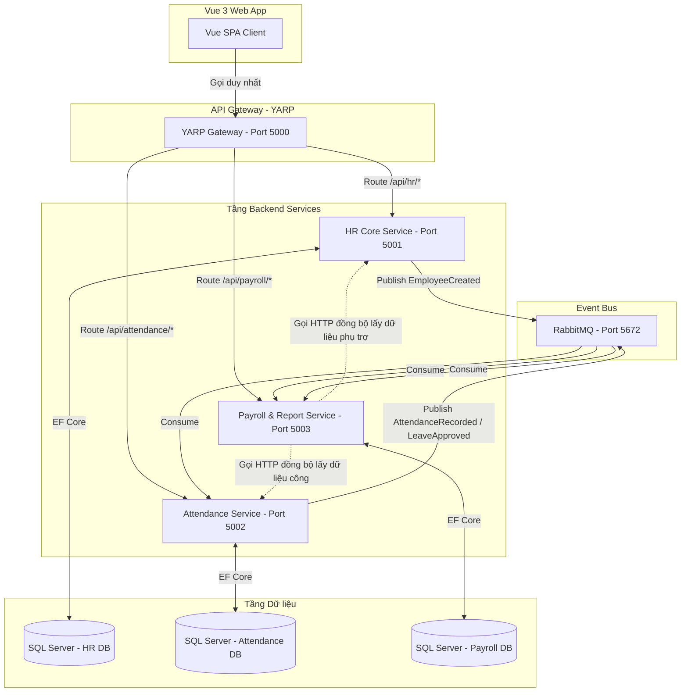

# Kế hoạch triển khai Chi tiết & Đánh giá Kiến trúc
## Đề tài số 3: Hệ thống Quản lý Nhân sự & Chấm công (HRMS)

Tài liệu này đánh giá tính đúng đắn của cấu trúc dự án hiện tại so với tài liệu hướng dẫn của giảng viên, phân tích sự lựa chọn kiến trúc phù hợp và đưa ra lộ trình (plan) chi tiết cho cả 3 nhóm để hoàn thiện bài tập lớn.

---

## 1. Đánh giá tính đúng đắn của dự án hiện tại

### 1.1. So sánh với tài liệu hướng dẫn của Giảng viên (`Huong_dan_BTL_Microservices.docx`)
*   **Ví dụ trong hướng dẫn:** Tài liệu của giảng viên viết cho **Đề tài số 01: Hệ thống Quản lý Bán hàng & Kho hàng** (gồm Nhóm 1: Product, Nhóm 2: Order, Nhóm 3: User).
*   **Thực tế đề tài của bạn:** Bạn đang làm **Đề tài số 03: Quản lý nhân sự và chấm công** (Phân chia: Nhóm 7 - HR Core, Nhóm 8 - Attendance, Nhóm 9 - Payroll & Report).
*   **Đánh giá sự tuân thủ:**
    *   **Đúng hướng:** Bạn đã áp dụng chính xác các nguyên lý kỹ thuật từ tài liệu hướng dẫn của thầy (sử dụng Monorepo, chia 3 DB riêng biệt không dùng khóa ngoại cứng chéo DB, giao tiếp bất đồng bộ qua RabbitMQ và đồng bộ qua API Gateway).
    *   **Cải tiến kỹ thuật:** Thay vì dùng *Ocelot* làm API Gateway như ví dụ của thầy, dự án hiện tại đang cấu hình **YARP (Yet Another Reverse Proxy)** của Microsoft. Đây là một sự lựa chọn rất tốt và hiện đại hơn Ocelot trong hệ sinh thái .NET.

### 1.2. Tình trạng Codebase hiện tại
*   **Cấu trúc thư mục (Monorepo):** Đã phân chia rất chuẩn: `frontend/` (Vue 3), `backend/` (gateway + 3 services), `shared/` (contracts), `infra/` (docker-compose & script khởi tạo cơ sở dữ liệu), `docs/` (tài liệu thiết kế).
*   **Cơ sở dữ liệu:** Đã có file script SQL khởi tạo 3 database riêng biệt (`HRMS_HrCoreDb`, `HRMS_AttendanceDb`, `HRMS_PayrollReportDb`) trong thư mục `infra/sqlserver/init/00_create_hrms_databases.sql`.
*   **Mức độ hoàn thiện:** Dự án hiện tại đang ở **giai đoạn Skeleton (Khung xương)**. 
    *   Các project backend đã được tạo nhưng chỉ mới có endpoint `/info` và `/modules` tĩnh để demo kết nối cơ bản qua Gateway.
    *   Các logic nghiệp vụ cốt lõi (Auth JWT, CRUD Nhân viên, Ca làm việc, Chấm công check-in/out, Đơn nghỉ phép, Tính toán bảng lương) **chưa được viết**.
    *   Frontend Vue 3 đã dựng khung Router, Store, Layout và màn hình Login cơ bản, chưa có các trang chức năng.

---

## 2. Phân tích Kiến trúc Hợp lý và Phù hợp

Hệ thống được thiết kế theo kiến trúc **Microservices (Monorepo)**. Dưới đây là phân tích vì sao kiến trúc này tối ưu cho dự án của bạn và cách vận hành nó:

### 2.1. Tại sao kiến trúc này hợp lý?
1.  **Chia sẻ trách nhiệm (Decoupling):** Mỗi nhóm (Nhóm 7, 8, 9) sở hữu một service và một database độc lập. Nhóm 8 sửa logic Chấm công sẽ không bao giờ làm hỏng hay khoá database của Nhóm 7.
2.  **Bản sao Projection dữ liệu (Idempotency):** Vì không được `JOIN` trực tiếp giữa các database, các Service sẽ đăng ký lắng nghe sự kiện từ RabbitMQ để tự tạo ra bảng **Projection (Bản sao tối thiểu)**. Ví dụ, bảng `EmployeeProjections` trong DB Chấm công và DB Lương sẽ chứa `EmployeeId`, `FullName`, `DepartmentId`, `Status` để hiển thị và kiểm tra điều kiện mà không cần gọi API sang HR Core.
3.  **Tích hợp bất đồng bộ (Asynchronous Integration):** Dùng RabbitMQ giúp hệ thống chạy mượt mà. Khi HR Core thêm nhân viên mới, event `EmployeeCreated` được đẩy lên hàng đợi, các service khác tự tiêu thụ và tạo bản ghi projection. Nếu service Chấm công bị crash tạm thời, tin nhắn vẫn nằm trên RabbitMQ và được xử lý lại khi service online lại.
4.  **Tích hợp đồng bộ (REST API):** Sử dụng HttpClient khi cần lấy dữ liệu tức thời và chính xác tại một thời điểm (Ví dụ: Payroll gọi sang Attendance lấy bảng công cuối tháng để chốt lương).

---

## 3. Lộ trình triển khai Chi tiết (Plan)

Kế hoạch này được chia làm 5 Phase trong vòng 2-3 tuần, phân vai cụ thể cho từng nhóm để đảm bảo tiến độ tích hợp.

### Phase 1: Nền tảng, Xác thực & Phân quyền (Ngày 1 - 3)
> [!IMPORTANT]
> Đây là bước then chốt. Nhóm 7 phải cung cấp JWT Token chuẩn để các nhóm khác cấu hình xác thực cho API của họ.

*   **Nhóm 7 (HR Core & Gateway):**
    1.  Thiết lập Database `HRMS_HrCoreDb`, tạo bảng `Users`, `Roles`, `UserRoles`.
    2.  Viết API `POST /api/auth/login` (Mã hóa mật khẩu bằng BCrypt, cấp JWT token chứa: `sub` (UserId), `email`, `roles`, `employeeId`).
    3.  Cấu hình Gateway YARP chuyển tiếp Token và xác thực cơ bản.
    4.  Frontend: Thiết lập Axios Interceptor tự động đính kèm `Authorization: Bearer <token>` vào mọi request. Viết logic Route Guard (chặn trang nếu chưa đăng nhập hoặc sai role).
*   **Nhóm 8 & Nhóm 9:**
    1.  Cấu hình thư viện JWT Bearer Authentication trong file `Program.cs` của service mình để giải mã token từ Gateway gửi xuống.
    2.  Thiết lập kết nối EF Core tới DB tương ứng (`HRMS_AttendanceDb` và `HRMS_PayrollReportDb`).

### Phase 2: Nghiệp vụ Nhân sự Core & Đồng bộ Event (Ngày 4 - 7)
> [!TIP]
> Giao tiếp qua RabbitMQ sử dụng thư viện **MassTransit** để đơn giản hóa cấu hình.

*   **Nhóm 7 (HR Core):**
    1.  Viết CRUD Phòng ban (`Departments`), Chức vụ (`Positions`), Nhân viên (`Employees`), Hợp đồng (`Contracts`).
    2.  Tích hợp MassTransit. Khi Thêm mới/Cập nhật/Thay đổi trạng thái nhân viên -> Publish các event tương ứng:
        *   `EmployeeCreated`
        *   `EmployeeUpdated`
        *   `EmployeeStatusChanged` (Ví dụ: chuyển sang Inactive khi nghỉ việc).
    3.  Xây dựng giao diện Frontend quản lý Nhân viên, Phòng ban, Chức vụ.
*   **Nhóm 8 & Nhóm 9:**
    1.  Tạo bảng `EmployeeProjections` trong cơ sở dữ liệu của mình.
    2.  Viết các `Consumer` tương ứng để lắng nghe 3 event từ Nhóm 7 phát ra. Khi nhận được event, lưu/cập nhật thông tin vào bảng `EmployeeProjections`.

### Phase 3: Nghiệp vụ Chấm công & Duyệt phép (Ngày 8 - 10)
*   **Nhóm 8 (Attendance Service):**
    1.  Viết API quản lý Ca làm (`Shifts`), Lịch làm việc (`WorkSchedules`).
    2.  Viết API Check-in/Check-out: Lưu thời gian thực tế, tính toán số giờ làm việc, so khớp với ca làm để xác định đi muộn/về sớm.
    3.  Viết API Đơn nghỉ phép (`LeaveRequests`) và duyệt phép.
    4.  Khi ghi nhận chấm công hoặc duyệt phép có lương/không lương -> Publish các event:
        *   `AttendanceRecorded`
        *   `LeaveApproved`
    5.  Xây dựng giao diện chấm công cho nhân viên và duyệt phép cho Manager.
*   **Nhóm 9 (Payroll & Report):**
    1.  Viết Consumer để lắng nghe và lưu dữ liệu công/nghỉ phép vào `AttendanceProjections` và `LeaveProjections` phục vụ tính lương.

### Phase 4: Tính lương & Báo cáo (Ngày 11 - 12)
*   **Nhóm 9 (Payroll & Report Service):**
    1.  Thiết kế quy tắc lương (`PayrollRules` - ví dụ: Lương ngày = Lương cơ bản / 26 ngày công).
    2.  Tạo kỳ lương (`PayrollPeriods` - ví dụ: Tháng 06/2026).
    3.  Viết logic tính lương: Lấy thông tin lương cơ bản từ hợp đồng (gửi yêu cầu REST API hoặc đồng bộ qua event) kết hợp với số ngày công thực tế từ `AttendanceProjections` và đơn nghỉ từ `LeaveProjections` để tạo bảng lương Draft.
    4.  Viết API Chốt lương (Khóa kỳ lương) và Xuất phiếu lương (`Payslips`).
    5.  Viết các API tổng hợp báo cáo (vẽ biểu đồ nhân sự, công, lương).
    6.  Xây dựng giao diện tính lương, xem phiếu lương và màn hình Dashboard báo cáo (sử dụng Chart.js/ApexCharts).

### Phase 5: Đóng gói Docker, Kiểm thử & Demo (Ngày 13 - 14)
*   **Cả 3 nhóm phối hợp:**
    1.  Mỗi nhóm viết 1 file `Dockerfile` cho service của mình và frontend.
    2.  Cập nhật file `infra/docker-compose.yml` để chạy toàn bộ hệ thống (gồm: SQL Server, RabbitMQ, Gateway, 3 Services backend và Frontend Vue).
    3.  Thực hiện test kiểm thử liên thông (End-to-End):
        *   Tạo nhân viên ở nhóm 7 -> Kiểm tra xem nhóm 8, 9 đã tự động cập nhật bản sao nhân viên chưa.
        *   Nhân viên check-in/out -> Kiểm tra dữ liệu công có đồng bộ sang nhóm 9.
        *   Tính lương và xuất báo cáo.
    4.  Hoàn thiện báo cáo phân tích thiết kế hệ thống (SAD) theo mẫu của giảng viên.

---

## 4. Công cụ & Thư viện Khuyến nghị sử dụng

| Công cụ / Thư viện | Phiên bản khuyến nghị | Vai trò |
| :--- | :--- | :--- |
| **.NET SDK** | .NET 8.0 (LTS) | Nền tảng Backend |
| **MassTransit.RabbitMQ** | Bản mới nhất | Giao tiếp Event-driven |
| **EF Core SQL Server** | 8.x | Truy xuất dữ liệu |
| **BCrypt.Net-Next** | Bản mới nhất | Mã hóa mật khẩu |
| **YARP.ReverseProxy** | Bản mới nhất | API Gateway |
| **Pinia & Vue Router** | Mặc định Vue 3 | Quản lý state & định tuyến Frontend |
| **Tailwind CSS** | v3.x | CSS Framework |
| **Chart.js hoặc ApexCharts**| Bản mới nhất | Vẽ biểu đồ báo cáo |
