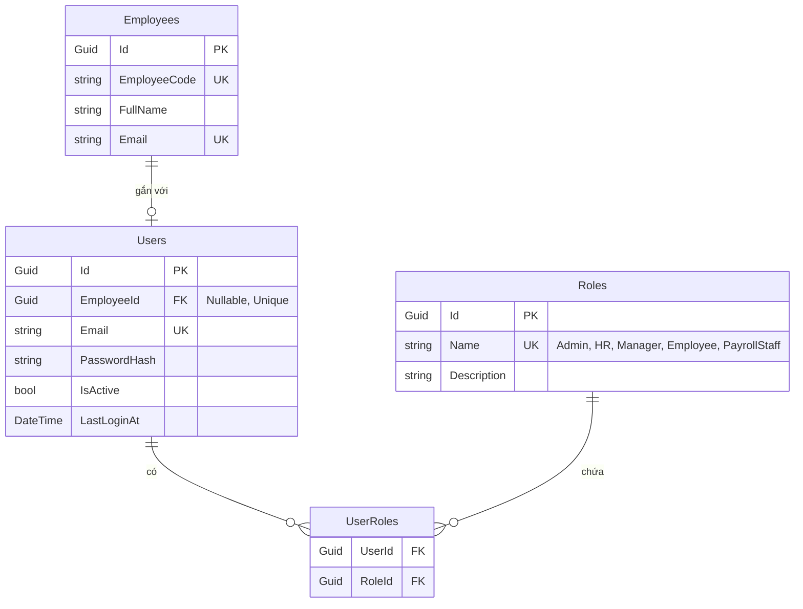
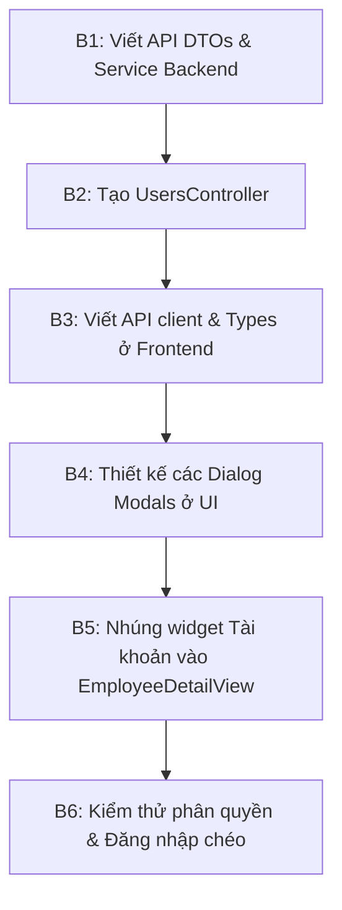

# Kế hoạch chi tiết: Bổ sung tính năng Cấp tài khoản & Phân quyền (User Account Management)

Tài liệu này vạch ra kế hoạch thiết kế và triển khai tính năng **Cấp tài khoản & Phân quyền** cho nhân sự trong hệ thống HRMS. Tính năng này cho phép Quản trị viên (Admin) cấp tài khoản đăng nhập, gán vai trò (Roles) và quản lý trạng thái hoạt động của nhân viên trực tiếp trên giao diện UI.

---

## 1. Mục tiêu & Các chức năng chính
1. **Cấp tài khoản mới (Grant Account):** Admin có thể tạo tài khoản đăng nhập (Email + Mật khẩu + Vai trò) cho bất kỳ nhân sự nào chưa có tài khoản.
2. **Phân quyền (Role Management):** Gán các vai trò cụ thể cho người dùng: `Admin`, `HR`, `Manager`, `Employee`, `PayrollStaff`.
3. **Đổi/Reset mật khẩu (Reset Password):** Cho phép đặt lại mật khẩu của người dùng khi cần thiết.
4. **Khóa/Mở khóa tài khoản (Lock/Unlock Account):** Kích hoạt (`IsActive = true`) hoặc tạm khóa (`IsActive = false`) tài khoản đăng nhập của nhân sự.

---

## 2. Thiết kế Cơ sở dữ liệu & Thực thể (Entities)
Hiện tại cơ sở dữ liệu `HRMS_HrCoreDb` đã có cấu trúc chuẩn cho các thực thể này. Mối quan hệ giữa các bảng được biểu diễn như sau:



---

## 3. Kế hoạch triển khai phía Backend (C# .NET 8)

### 3.1 Thiết kế DTOs (Data Transfer Objects)
Tạo các DTOs tại `backend/services/hr-core/Application/Dtos/`:

*   **`CreateUserDto`:** Dùng khi cấp tài khoản mới.
    ```csharp
    public record CreateUserDto(
        Guid EmployeeId,
        string Email,
        string Password,
        List<string> Roles
    );
    ```
*   **`UpdateUserRolesDto`:** Dùng khi thay đổi quyền hạn.
    ```csharp
    public record UpdateUserRolesDto(List<string> Roles);
    ```
*   **`ResetPasswordDto`:** Dùng khi đặt lại mật khẩu.
    ```csharp
    public record ResetPasswordDto(string NewPassword);
    ```
*   **`UserDto`:** Dữ liệu trả về cho client.
    ```csharp
    public record UserDto(
        Guid Id,
        Guid? EmployeeId,
        string Email,
        bool IsActive,
        List<string> Roles,
        DateTime? LastLoginAt
    );
    ```

### 3.2 Xây dựng Interface & Service quản lý tài khoản (`IUserService` / `UserService`)
Tạo mới dịch vụ tại `backend/services/hr-core/Application/Interfaces/IUserService.cs` và `Application/Services/UserService.cs`:

*   **Các nghiệp vụ cần xử lý:**
    1.  `CreateUserAsync(CreateUserDto dto)`:
        *   Kiểm tra nhân viên (`Employee`) có tồn tại hay không.
        *   Kiểm tra email hoặc nhân viên đã có tài khoản hay chưa (tránh trùng lặp).
        *   Mã hóa mật khẩu bằng `PasswordHasher.HashPassword(dto.Password)`.
        *   Tạo thực thể `User`, gán các `UserRole` tương ứng với danh sách quyền truyền lên.
        *   Lưu thay đổi vào Database qua Entity Framework.
    2.  `UpdateRolesAsync(Guid userId, UpdateUserRolesDto dto)`:
        *   Tìm user, xóa toàn bộ bản ghi cũ trong bảng `UserRoles`.
        *   Gán các bản ghi `UserRole` mới dựa theo danh sách quyền mới.
    3.  `ResetPasswordAsync(Guid userId, ResetPasswordDto dto)`:
        *   Mã hóa mật khẩu mới và cập nhật trường `PasswordHash`.
    4.  `ChangeStatusAsync(Guid userId, bool isActive)`:
        *   Cập nhật cờ `IsActive = isActive`.

### 3.3 Xây dựng API Controller (`UsersController.cs`)
Tạo mới controller tại `backend/services/hr-core/Controllers/UsersController.cs`:

*   **Các Endpoints:**
    *   `GET /api/v1/hr/users` — Lấy danh sách tài khoản kèm vai trò (chỉ dành cho `Admin`, `HR`).
    *   `GET /api/v1/hr/users/employee/{employeeId}` — Lấy thông tin tài khoản của 1 nhân viên cụ thể.
    *   `POST /api/v1/hr/users` — Cấp tài khoản mới cho nhân viên.
    *   `PUT /api/v1/hr/users/{id}/roles` — Cập nhật phân quyền tài khoản.
    *   `PUT /api/v1/hr/users/{id}/password` — Đặt lại mật khẩu.
    *   `PUT /api/v1/hr/users/{id}/status` — Khóa hoặc kích hoạt tài khoản.

---

## 4. Kế hoạch triển khai phía Frontend (Vue 3 / TypeScript)

### 4.1 Định nghĩa Kiểu dữ liệu & API Client
1.  **Định nghĩa Types (`frontend/src/types/user.types.ts`):**
    ```typescript
    export interface UserAccount {
      id: string
      employeeId: string | null
      email: string
      isActive: boolean
      roles: string[]
      lastLoginAt: string | null
    }
    ```
2.  **Viết dịch vụ gọi API (`frontend/src/api/user.service.ts`):**
    ```typescript
    import api from './axios'
    // chi tiết các hàm getUserAccountByEmployee, grantAccount, updateRoles, resetPassword, changeStatus
    ```

### 4.2 Tích hợp UI vào Giao diện Quản lý Nhân sự

#### Option A: Tích hợp trực tiếp vào chi tiết nhân sự (Khuyên dùng)
Giao diện thông tin chi tiết nhân sự (`EmployeeDetailView.vue`) sẽ được bổ sung một Widget mới tên là **"Tài khoản hệ thống"** (nằm bên cạnh các widget Thông tin cá nhân, Hợp đồng lao động).

*   **Nếu nhân viên CHƯA CÓ tài khoản:**
    *   Hiển thị thông báo: *"Nhân viên này chưa được cấp tài khoản truy cập hệ thống."*
    *   Hiển thị nút: **[ Cấp tài khoản đăng nhập ]** (Chỉ hiển thị với Admin/HR).
*   **Nếu nhân viên ĐÃ CÓ tài khoản:**
    *   Hiển thị thông tin: Email đăng nhập, Trạng thái (Hoạt động / Bị khóa), Các quyền đang sở hữu, Lần đăng nhập cuối cùng.
    *   Hiển thị các nút thao tác nhanh:
        *   **[ Đổi quyền hạn ]**: Mở modal tích chọn vai trò mới.
        *   **[ Đặt lại mật khẩu ]**: Mở modal nhập mật khẩu mới.
        *   **[ Khóa tài khoản ]** / **[ Kích hoạt ]**: Thay đổi nhanh trạng thái hoạt động.

```
+--------------------------------------------------------------+
| 👤 TÀI KHOẢN HỆ THỐNG                                        |
|--------------------------------------------------------------|
| Email đăng nhập:  nguyenvana@hrms.com                        |
| Trạng thái:       ● Đang hoạt động                           |
| Vai trò:          [ Nhân viên ]  [ Quản lý ]                 |
| Đăng nhập cuối:   21/06/2026 15:30                           |
|--------------------------------------------------------------|
| Lựa chọn thao tác:                                           |
|   [ Đổi quyền hạn ]   [ Đặt lại mật khẩu ]   [ Khóa tài khoản ] |
+--------------------------------------------------------------+
```

#### Option B: Trang quản trị danh sách tài khoản tập trung
Tạo một trang quản trị tài khoản riêng biệt để hiển thị danh sách tất cả các tài khoản đang tồn tại trong hệ thống, hỗ trợ tìm kiếm nhanh, lọc theo vai trò và khóa tài khoản hàng loạt.

---

## 5. Các bước triển khai & Thứ tự thực hiện



1.  **Bước 1 (Backend):** Triển khai logic tạo user, gán role và đổi mật khẩu trong `UserService.cs`.
2.  **Bước 2 (Backend):** Tạo `UsersController` và cấu hình Routing để expose các đầu endpoint API.
3.  **Bước 3 (Frontend):** Khai báo các TypeScript types và viết `user.service.ts` để kết nối API.
4.  **Bước 4 (Frontend):** Thiết kế `GrantAccountModal.vue` (hỗ trợ tự động điền email của nhân sự, chọn checkbox quyền, tự động sinh mật khẩu) và `ResetPasswordModal.vue`.
5.  **Bước 5 (Frontend):** Tích hợp widget này vào `EmployeeDetailView.vue` và phân quyền hiển thị (chỉ Admin mới nhìn thấy phần cấu hình tài khoản của người khác).
6.  **Bước 6 (Kiểm thử):** Thử cấp tài khoản cho một nhân viên mới với quyền `Manager` hoặc `Employee` rồi đăng nhập bằng tài khoản đó để kiểm tra giao diện Dashboard hiển thị tương ứng.

---

> [!NOTE]
> Để bảo mật, các endpoint trong `UsersController` sẽ được gán filter `[Authorize(Roles = "Admin")]` để đảm bảo chỉ có Admin hệ thống mới có quyền cấp tài khoản hoặc sửa đổi quyền truy cập của nhân viên.
